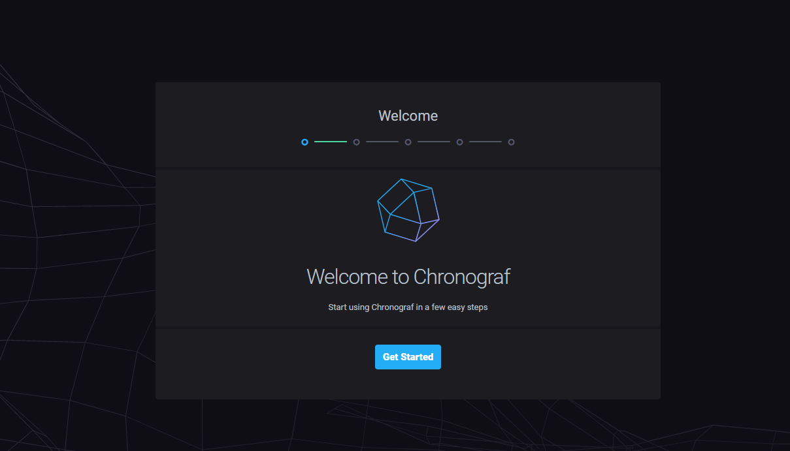
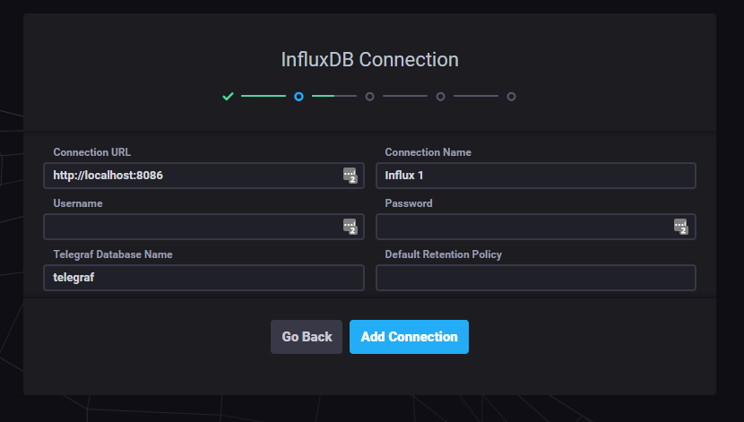
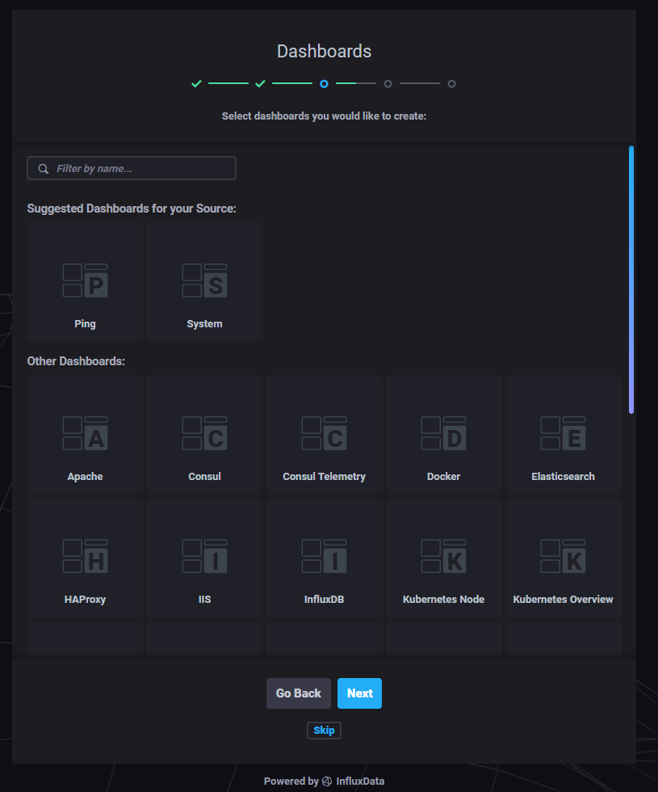
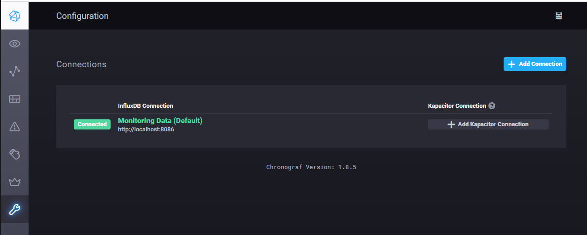
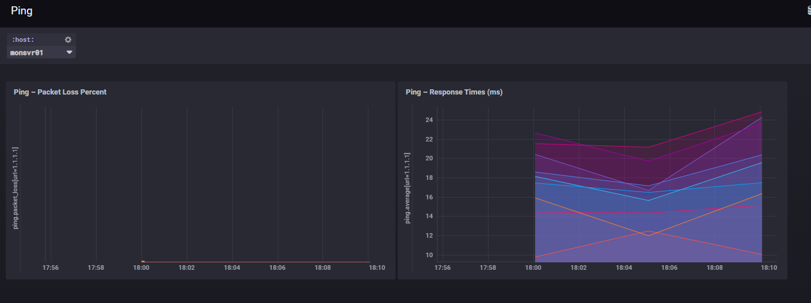

# Setting Up a Basic Performance Monitoring Server

## Building Graphs

### Introduction
TODO

### Setting Up Chronograf
If you setup the port forwards in Chapter 1, you should be able to point your browser at http://localhost:8888 and be presented with the following:

Click "Getting Started", you'll then be presented with the following:

The default settings should mostly be ok but update the "Connection Name" to be "Monitoring Data" and "Database Name"  to be "monitoring", 
then click Add Connection.

You should get a popup message saying "Successfully Connected"

We now get the options of how to visualise the data and Chrongraph kindly provides us with a suggestion for a "Ping" dashboard.  

05_03_chronograf_dashboards

Select and then click "Create 1 Dashboard"

Skup the Kapacitor Connection for now, we'll come back to that in a later tutorial.

That completes the basic setup, click "View All Connections".

## Using the Dashboards
After the initial setup, you should be on the Configuration tab, displaying our new connection.

Clicking he 4th Icon on the left will take us to our dashboards.  If you then click on "Ping" you'll be taken to the same data for our 
ping input but this time in a more visual way.

Ok so it is not that interesting but all things start small.  Using the sample dashboard will allow us to learn how to tweak them and where all that
query stuff comes in.

## Copying the chart for Big Pings
If you're network is running reliably the "Packet Loss PErcent" chart is probably very boring with nothing on show, lets concentrate no the Response Time.

Hover over the Response Times chart and some buttons wil appear click the "Clone" button (looks like two squares overlapping) and then click "Clone Cell".

A new chart should appear with a suffix of "(clone 1)". Hover over this chart and the click the configure button (looks like a pen/pencil).

This will open the fill the screen with the one chart.  Under the chart is the query by which it is generated.

We need to amend the query to pick up our big_ping input.  Although the query is more complex, the format is stil the same as what we did earlier, look for 
the "FROM" and replace "ping" with "big_ping". Click Submit Query and the graph will update.

Next change the title at the top of the screen to show something like "Internal Pings". Finally click the Save buton (Green tick in the top right corner)

Back at the Ping dashboard should now have two response time graphs.

You may be wondering why there are sometimes bits of data missing at the start and end of the chart. this is because we are only polling every 5 minutes.  
If you view a very short timeframe (less than 5 minutes) there simply won't be any data to show.

## Summary
In this section we setup some basic visualisations for our data.  

The next section we'll get more into network monitoring by querying our devices using SNMP.

When you are ready, let start [Setting Up SNMP Monitoring](06_SNMP_Monitoring.md)

